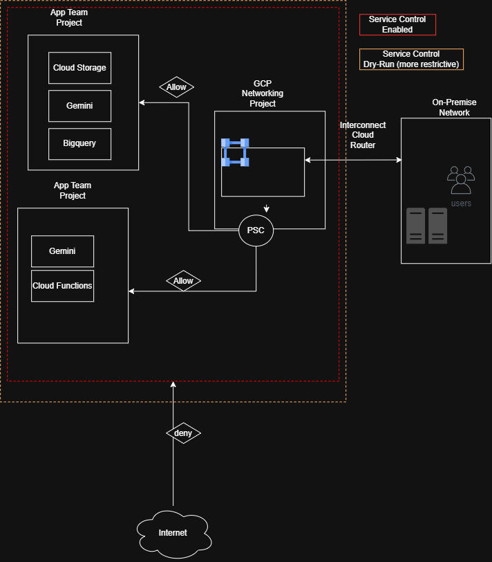

--
title: "Learnings from Google Service Controls in Large Organizations"
description: "We agreed to follow Google's recommendations to enable VPC-SC here's what we learned"
author: "Jason Phillips"
date: 2026-09-08
categories: [GCP, Infrastructure as Code, DevOps, Networking]
tags: [GCP, Google Cloud, Terraform, Hybrid Cloud, Networking]
image: ./../assets/img/eb133113-9984-43ff-89c4-102d10878be9.png
layout: post
---

# VPC Service Controls Learnings

Our organization recently made the decision to go all-in with Google Cloud Platform. We also have significant on-premises usage, so we leveraged hybrid networking connectivity (I will create another post detailing this endeavor!).

During our security pillar workshop with Google, we learned that it was recommended to leverage VPC-SC to improve our security posture and protect our boundary of trust.

## VPC Service Controls (the name is a little misleading)

Google VPC-SCs, or VPC Service Controls: in my opinion, "VPC" in the name is somewhat misleading. They aren’t directly tied to a VPC (the virtual network you create for infrastructure services like compute instances and network interfaces).

Instead, VPC Service Controls act as a defense solution for platform-level API services (things like `googleapis.com`) inside a GCP project. VPC-SC isn't designed to protect infrastructure-related compute services like GCE directly, but it can control how compute resources access API services.

## What we decided

We wanted GCP to allow connectivity from our proxy-IPs or be able to connect through our hybrid network (perhaps with VPC-SC).

1. All GCP projects protected via post-provisioning.
2. We decided to protect all the services we are using and then continue.

## What we learned

All GCP projects that should communicate need to be able to talk to each other, so we created a `vpc-enrollment` service to ensure all projects are added to the VPC-SC. This also allows us to avoid drift if a VPC comes from an M&A or is truly public.

## Challenges & Workarounds

Google Cloud Shell functionality was impacted following our VPC Service Controls implementation. Because Cloud Shell provisions VMs outside of the perimeter boundary, standard access is blocked by default. 

To address this, we established dedicated, authorized service accounts for necessary API access, while advising general users to leverage local workstation environments configured with the Google Cloud SDK. While Cloud Shell remains a convenient tool for quick tasks, leveraging local client tools or controlled access pathways ensures consistent security enforcement.

## Security is Iterative

Implementing VPC Service Controls is an iterative process. We established a dual-perimeter architecture consisting of two distinct service perimeters: one operating in **Dry-Run** mode for testing and audit, and another in **Enforced** mode for active production protection.

The Dry-Run perimeter is configured with our strict, target security controls to simulate enforcement without blocking actual traffic. This strategy allows us to review Cloud Audit Logs, identify potential service disruptions or access issues, and fine-tune ingress/egress rules safely. Once all violations and dependency issues in the Dry-Run environment have been identified and remediated, the updated rules are promoted to the Enforced perimeter, ensuring robust protection without impacting operational stability.

## Conclusion

Implementing VPC Service Controls is a journey that underscores the fundamental truth: security is an ongoing, iterative process rather than a static destination. By leveraging a dual-perimeter strategy—carefully testing rules in Dry-Run mode before promoting them to Enforced mode—we successfully safeguarded our operations while preventing service disruptions. Ultimately, protecting your boundary of trust is not just a technical precaution, but a vital cornerstone of a modern, resilient cloud architecture.